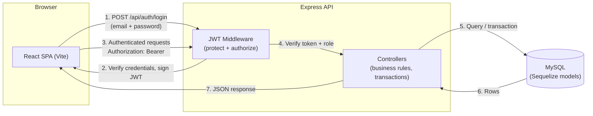
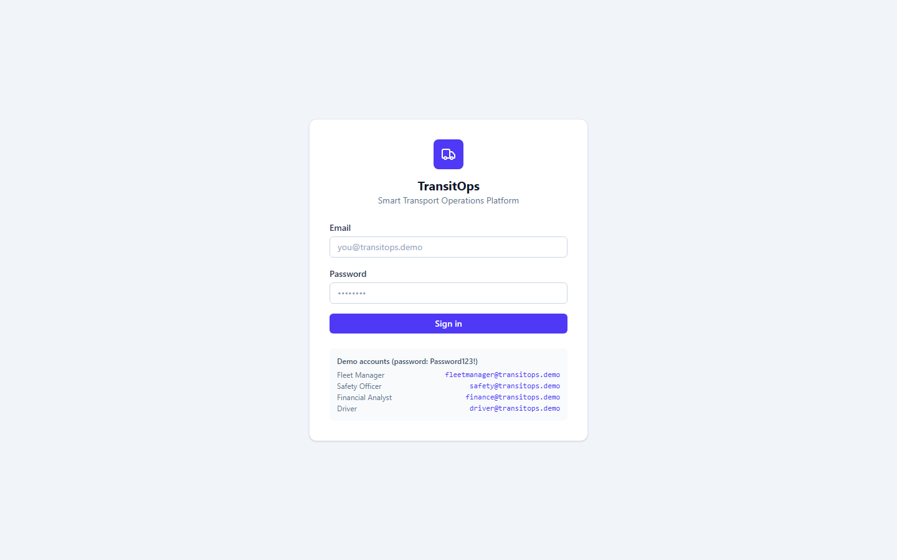
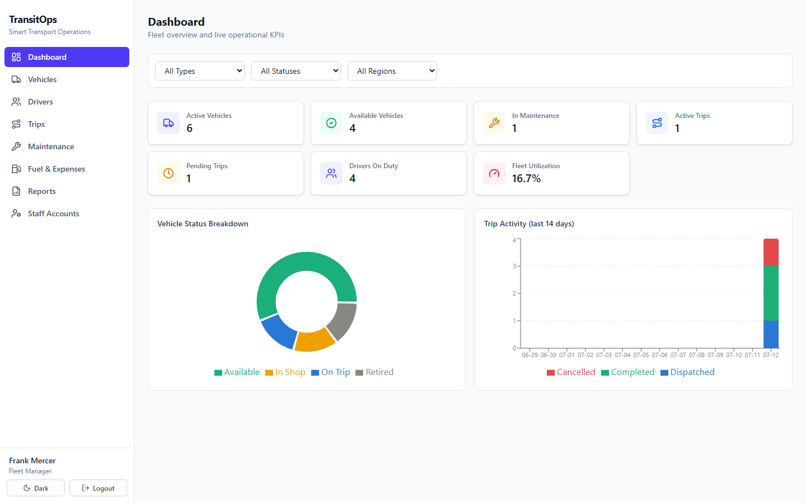
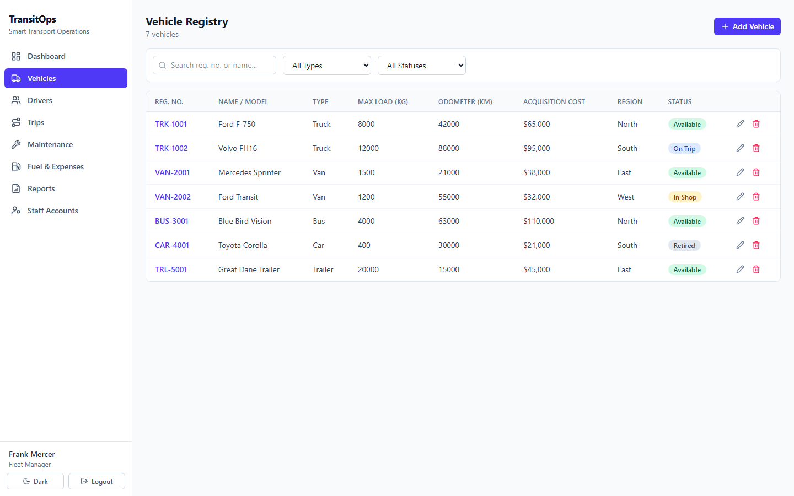
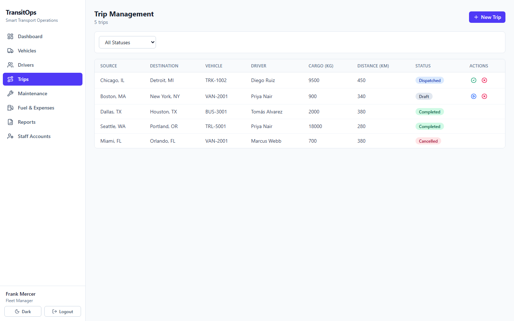
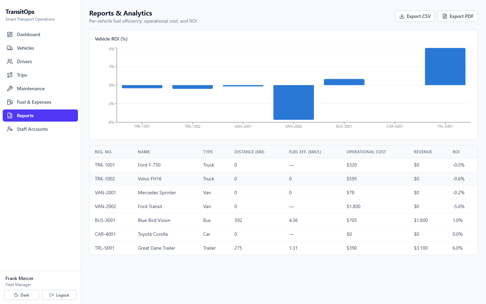

# 🚚 TransitOps — Smart Transport Operations Platform

**Fleet, driver, and trip lifecycle management for logistics operators — with real server-side RBAC, not just a role-tinted UI.**

<p>
  
  
  
  
  
  
  
  
  
</p>

<!--
DEMO GIF — record a ~15–20s screen capture of: create a vehicle → create a
driver → create a Draft trip → Dispatch it (watch vehicle/driver flip to
"On Trip") → Complete it (watch both flip back to "Available"). Trim/convert
to an optimized GIF (e.g. `ffmpeg -i demo.mp4 -vf "fps=12,scale=960:-1" -loop 0 demo.gif`,
or gifski for smaller files) and save it as docs/screenshots/demo.gif, then
uncomment the line below.
<p align="center">
  
</p>
-->

---

## Overview

Fleet operators juggle vehicles, drivers, trips, maintenance, and fuel/expense
records across spreadsheets and disconnected tools, which makes it easy for a
suspended driver to get dispatched, a vehicle in the shop to get double-booked,
or a trip to be logged against a vehicle that's already out on the road.

**TransitOps** centralizes all of it behind one authenticated API with a single
source of truth for vehicle/driver/trip state. Every state transition — dispatch,
complete, cancel, send to maintenance — is enforced **server-side** with
transactional row locking, so the rules hold even if two people click at once,
not just when the UI happens to agree.

Four role-scoped dashboards (Fleet Manager, Driver, Safety Officer, Financial
Analyst) give each user exactly the tools their job needs, backed by real KPIs,
CSV/PDF reporting, and automated license-expiry reminders.

## Key Features

**🔐 Auth & RBAC**
- JWT-based authentication, bcrypt-hashed passwords
- 4 distinct roles enforced **server-side** in every controller (not just hidden nav links)
- Frontend route guarding + automatic redirect-to-login on token expiry (401)

**📊 Dashboard & KPIs**
- Live fleet utilization, active trips, revenue, and maintenance-cost KPIs
- Vehicle status breakdown and trips-trend charts (Recharts)

**🚗 Vehicle Registry**
- Full CRUD with unique registration-number enforcement
- Document uploads per vehicle (registration, insurance, etc.) via Multer
- Search, filter, and sort across type, status, and region

**🧑‍✈️ Driver Management**
- License category/expiry tracking, safety scores, status (Available / On Trip / Off Duty / Suspended)
- Automated + on-demand license-expiry reminder sweep (node-cron)

**🛣️ Trip Lifecycle Management**
- Draft → Dispatched → Completed/Cancelled, with automatic vehicle/driver status side-effects at every transition
- Cargo-weight-vs-capacity validation, driver license/status eligibility checks

**🔧 Maintenance Workflow**
- Opening a record flips the vehicle to "In Shop" and removes it from the dispatch pool automatically
- Closing it restores "Available" status

**⛽ Fuel & Expense Tracking**
- Per-vehicle fuel logs and categorized expenses, feeding directly into the reporting layer

**📈 Reports & Analytics**
- Per-vehicle ROI and fuel-efficiency (km/L) computed from real trip/fuel data
- CSV and PDF export, streamed through an authenticated request (not a public link)

**✨ Bonus features**
- Dark mode (persisted, respects system preference on first load)
- Global search/filter/sort on all list pages
- Vehicle document management with file upload/download
- Email reminders with graceful fallback (logs to console + DB if SMTP isn't configured)

---

## Tech Stack

| Layer | Technology |
|---|---|
| **Frontend** | React 19 (Vite), React Router 7, Tailwind CSS 4, Recharts, Axios, lucide-react |
| **Backend** | Node.js, Express 5, Sequelize 6 ORM |
| **Database** | MySQL 8 |
| **Auth** | JWT (jsonwebtoken) + bcrypt (bcryptjs), server-enforced 4-role RBAC |
| **Other** | Multer (uploads), Nodemailer (email), node-cron (scheduled jobs), json2csv + pdfkit (exports) |

---

## System Architecture



---

## User Roles

| Role | What they can do |
|---|---|
| **Fleet Manager** | Full access: vehicles, drivers, trips (create/dispatch/complete/cancel), maintenance, fuel & expenses, reports, and staff account management |
| **Driver** | View their own trips |
| **Safety Officer** | View/manage drivers and maintenance records, view vehicles, view reports (compliance-focused) |
| **Financial Analyst** | View vehicles, manage fuel logs & expenses, view reports (cost-focused) |

Role access is filtered both in the UI navigation and — the part that actually
matters — re-checked on every protected route on the server, so a user can't
reach a disallowed action by guessing a URL or calling the API directly.

---

## Business Rules

These are enforced in the controllers (server-side), not just suggested by the UI:

- Vehicle registration numbers and driver license numbers must be unique
- A vehicle must be `Available` to be added to a trip's dispatch pool
- A driver must be `Available` **and** hold a non-expired license to be dispatched
- Cargo weight on a trip cannot exceed the assigned vehicle's `maxLoadCapacityKg`
- Dispatching a trip atomically flips both the vehicle and driver to `On Trip` (row-locked transaction)
- Completing or cancelling a trip atomically reverts both back to `Available`
- Opening a maintenance record flips the vehicle to `In Shop` and removes it from the available/dispatch pool; closing it restores `Available`
- All of the above run inside Sequelize transactions with row-level locking, so concurrent requests can't race each other into an inconsistent state

---

## Screenshots

> No visual/browser-automation tool was available to capture these directly in this session, so the images below are placeholders. **To fill them in:** run the app locally (see [Getting Started](#getting-started)), log in as each demo account, and save screenshots to `docs/screenshots/` using the filenames listed — then this section will render automatically on GitHub.

| Page | File to save |
|---|---|
| Login page | `docs/screenshots/login.png` |
| Dashboard (KPIs + charts, logged in as Fleet Manager) | `docs/screenshots/dashboard.png` |
| Vehicle registry (list + filters) | `docs/screenshots/vehicles.png` |
| Trip management (dispatch/complete flow) | `docs/screenshots/trips.png` |
| Reports page (CSV/PDF export) | `docs/screenshots/reports.png` |

<p align="center">
  
  
</p>
<p align="center">
  
  
</p>
<p align="center">
  
</p>

---

## Getting Started

### Prerequisites

- Node.js 18+
- A running MySQL server (MySQL 8+ recommended) — either:
  - **Local:** MySQL Community Server (or MySQL Workbench's bundled server) on `127.0.0.1:3306`, or
  - **Cloud/managed:** any hosted MySQL instance (PlanetScale, RDS, Aiven, etc.)
- The target database (`transitops` by default) doesn't need to exist ahead of time — `npm run seed` creates it via Sequelize `sync({ force: true })` — but the MySQL *server* must be reachable, and your user needs permission to create/alter tables in it.

### 1. Clone and install

```bash
git clone https://github.com/poojaaxx/TransitOps-Smart-Transport-Operations-Platform.git
cd TransitOps-Smart-Transport-Operations-Platform
npm run install:all
```

`install:all` installs the root, `backend/`, and `frontend/` dependencies in one shot.

### 2. Configure environment variables

```bash
cp backend/.env.example backend/.env
cp frontend/.env.example frontend/.env
```

Edit `backend/.env`:

| Variable | Purpose |
|---|---|
| `DB_HOST` / `DB_PORT` / `DB_USER` / `DB_PASSWORD` / `DB_NAME` | MySQL connection details |
| `JWT_SECRET` | Any long random string |
| `CLIENT_URL` | Frontend origin allowed by CORS (default `http://localhost:5173`) |
| `SMTP_*` | Optional — leave blank to simulate license-reminder emails (logged to console + `EmailLog` table instead of sent) |

`frontend/.env` can stay empty for local dev — the Vite dev server proxies `/api` and `/uploads` to `http://localhost:5000` (see `frontend/vite.config.js`).

### 3. Seed demo data

```bash
npm run seed
```

Drops and recreates every table, then seeds 4 roles, 4 users, 7 vehicles, 6 drivers, and trip/maintenance/fuel/expense records covering every lifecycle state. Safe to re-run any time.

### 4. Run the app

```bash
npm run dev
```

- Backend API: http://localhost:5000
- Frontend: http://localhost:5173

Or run them separately:

```bash
# terminal 1
cd backend && npm run dev

# terminal 2
cd frontend && npm run dev
```

---

## API Documentation

All routes are prefixed with `/api`. Every route except `POST /auth/login` and `GET /health` requires `Authorization: Bearer <token>`.

<details>
<summary><strong>Auth & Users</strong></summary>

| Method | Route | Description | Auth |
|---|---|---|---|
| POST | `/auth/login` | Log in, returns JWT + user profile | Public |
| GET | `/auth/me` | Get current authenticated user | Any role |
| GET | `/users` | List staff accounts | Fleet Manager |
| POST | `/users` | Create a staff account | Fleet Manager |
| PATCH | `/users/:id` | Update a staff account | Fleet Manager |

</details>

<details>
<summary><strong>Vehicles</strong></summary>

| Method | Route | Description | Auth |
|---|---|---|---|
| GET | `/vehicles` | List all vehicles (filter/sort/search) | Any role |
| GET | `/vehicles/available` | List vehicles eligible for dispatch | Any role |
| GET | `/vehicles/:id` | Get a single vehicle | Any role |
| GET | `/vehicles/:id/documents` | List a vehicle's uploaded documents | Any role |
| POST | `/vehicles` | Create a vehicle | Fleet Manager |
| PATCH | `/vehicles/:id` | Update a vehicle | Fleet Manager |
| DELETE | `/vehicles/:id` | Delete a vehicle | Fleet Manager |
| POST | `/vehicles/:id/documents` | Upload a document | Fleet Manager |
| DELETE | `/vehicles/:id/documents/:docId` | Delete a document | Fleet Manager |

</details>

<details>
<summary><strong>Drivers</strong></summary>

| Method | Route | Description | Auth |
|---|---|---|---|
| GET | `/drivers` | List all drivers | Any role |
| GET | `/drivers/available` | List drivers eligible for dispatch | Any role |
| GET | `/drivers/:id` | Get a single driver | Any role |
| POST | `/drivers/check-license-reminders` | Manually trigger license-expiry sweep | Fleet Manager, Safety Officer |
| POST | `/drivers` | Create a driver | Fleet Manager |
| PATCH | `/drivers/:id` | Update a driver | Fleet Manager, Safety Officer |
| DELETE | `/drivers/:id` | Delete a driver | Fleet Manager |

</details>

<details>
<summary><strong>Trips</strong></summary>

| Method | Route | Description | Auth |
|---|---|---|---|
| GET | `/trips` | List all trips | Any role |
| GET | `/trips/:id` | Get a single trip | Any role |
| POST | `/trips` | Create a Draft trip | Fleet Manager |
| PATCH | `/trips/:id` | Update a Draft trip | Fleet Manager |
| DELETE | `/trips/:id` | Delete a Draft trip | Fleet Manager |
| POST | `/trips/:id/dispatch` | Dispatch (vehicle + driver → On Trip) | Fleet Manager |
| POST | `/trips/:id/complete` | Complete (vehicle + driver → Available) | Fleet Manager |
| POST | `/trips/:id/cancel` | Cancel (vehicle + driver → Available) | Fleet Manager |

</details>

<details>
<summary><strong>Maintenance</strong></summary>

| Method | Route | Description | Auth |
|---|---|---|---|
| GET | `/maintenance` | List maintenance records | Any role |
| GET | `/maintenance/:id` | Get a single record | Any role |
| POST | `/maintenance` | Open a record (vehicle → In Shop) | Fleet Manager |
| PATCH | `/maintenance/:id` | Update a record | Fleet Manager |
| PATCH | `/maintenance/:id/close` | Close a record (vehicle → Available) | Fleet Manager |

</details>

<details>
<summary><strong>Fuel Logs & Expenses</strong></summary>

| Method | Route | Description | Auth |
|---|---|---|---|
| GET | `/fuel-logs` | List fuel logs | Any role |
| POST | `/fuel-logs` | Create a fuel log | Fleet Manager, Financial Analyst |
| DELETE | `/fuel-logs/:id` | Delete a fuel log | Fleet Manager |
| GET | `/expenses` | List expenses | Any role |
| POST | `/expenses` | Create an expense | Fleet Manager, Financial Analyst |
| DELETE | `/expenses/:id` | Delete an expense | Fleet Manager |

</details>

<details>
<summary><strong>Dashboard & Reports</strong></summary>

| Method | Route | Description | Auth |
|---|---|---|---|
| GET | `/dashboard/kpis` | Fleet utilization, active trips, revenue, maintenance cost | Any role |
| GET | `/dashboard/vehicle-status-breakdown` | Vehicle counts by status | Any role |
| GET | `/dashboard/trips-trend` | Trip volume over time | Any role |
| GET | `/reports/vehicles` | Per-vehicle ROI & fuel-efficiency report (JSON) | Any role |
| GET | `/reports/vehicles/csv` | Same report, CSV export | Any role |
| GET | `/reports/vehicles/pdf` | Same report, PDF export | Any role |

</details>

---

## Project Structure

```
transitops/
├── backend/
│   ├── src/
│   │   ├── config/          Database connection setup
│   │   ├── controllers/     Business logic, transactions, validation
│   │   ├── jobs/             Scheduled license-expiry reminder job
│   │   ├── middleware/       JWT auth, RBAC, upload, error handling
│   │   ├── models/           Sequelize models + associations
│   │   ├── routes/           Express route definitions
│   │   ├── seed/             Demo data seeding script
│   │   └── utils/            Constants, JWT helpers, email, PDF generation
│   ├── uploads/documents/    Uploaded vehicle documents
│   └── server.js
├── frontend/
│   └── src/
│       ├── api/              Axios client + endpoint definitions
│       ├── components/       Layout, route guards, shared UI components
│       ├── context/          Auth + theme (dark mode) providers
│       ├── pages/            One component per route/screen
│       └── utils/            Roles, chart color helpers
├── docs/screenshots/         README images (see Screenshots section)
├── package.json               Root convenience scripts (install:all, dev, seed)
└── README.md
```

---

## Live Demo

- **Frontend:** https://frontend-three-smoky-54.vercel.app
- **Backend API:** https://transitops-backend-x2vw.onrender.com/api/health

> The backend is hosted on Render's free tier, which spins down after inactivity — the first request after idle time can take **~30 seconds** to wake up. Subsequent requests are fast.

**Demo logins** (all use password `Password123!`):

| Role | Email |
|---|---|
| Fleet Manager | fleetmanager@transitops.demo |
| Safety Officer | safety@transitops.demo |
| Financial Analyst | finance@transitops.demo |
| Driver | driver@transitops.demo |

---

## Future Enhancements

- Real-time vehicle GPS tracking / live map view
- Push/SMS notifications for license expiry and maintenance due dates
- Multi-tenant support (multiple fleet organizations on one deployment)
- Automated test suite (unit + integration) — currently verified via manual and scripted API testing, not a checked-in test suite

---

## License

MIT — see [LICENSE](LICENSE).
